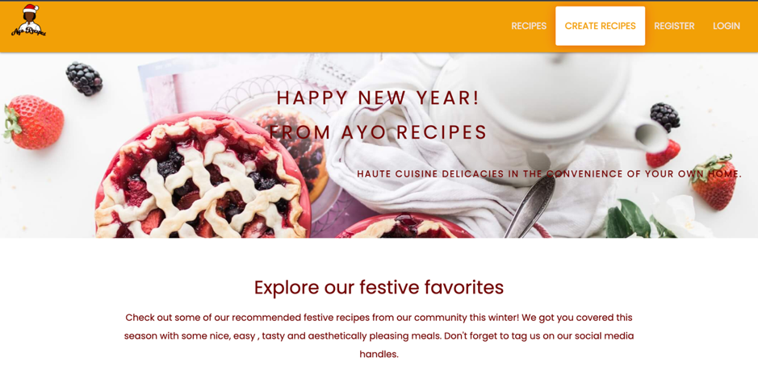

# AYO RECIPES 

[Back to main README file](README.md)

[View the delopyed site](https://didisimmons.github.io/Flybody-gym/) 

## TESTING
 

**Table of Contents** 
1. [Validator Testing](#validator-testing)  
   - [HTML](#html)   
   - [CSS](#css)
1. [User Stories Testing](#user-stories-testing)  
   - [Unregistered User Goals](#unregistered-user-goals)   
   - [Registered User Goals](#registered-user-goals)  
   - [Admin User Goals](#admin-user-goals)  
2. [Autoprefixer CSS](https://github.com/dissyulina/cookle-cookbook/blob/main/TESTING.md#2-auto-prefixer-css)    
2. [Manual Testing](https://github.com/dissyulina/cookle-cookbook/blob/main/TESTING.md#3-manual-testing-by-the-developer)   
   - [Browsers Compatibility](https://github.com/dissyulina/cookle-cookbook/blob/main/TESTING.md#browsers-compatibility)   
   - [Devices](https://github.com/dissyulina/cookle-cookbook/blob/main/TESTING.md#devices)   
   - [Responsiveness](https://github.com/dissyulina/cookle-cookbook/blob/main/TESTING.md#responsiveness)   
   - [Links](https://github.com/dissyulina/cookle-cookbook/blob/main/TESTING.md#links)  
   - [Forms](https://github.com/dissyulina/cookle-cookbook/blob/main/TESTING.md#forms)   
   - [Defensive Testing](https://github.com/dissyulina/cookle-cookbook/blob/main/TESTING.md#defensive-testing)  
  
5. [JSHint Testing](https://github.com/dissyulina/cookle-cookbook/blob/main/TESTING.md#5-javascript-testing)    
6. [Pep8 Online Testing](https://github.com/dissyulina/cookle-cookbook/blob/main/TESTING.md#6-python-testing)
7. [Lighthouse Testing](https://github.com/dissyulina/cookle-cookbook/blob/main/TESTING.md#7-lighthouse-testing)  
   
 

## **VALIDATOR TESTING**
#### **HTML**
* [W3C Markup Validation](https://validator.w3.org/): This is also used to check the validity of the html code for all webpages created. Our code was found to have some errors due to the jinja template. 

#### **HTML**
* [W3C CSS validation](https://jigsaw.w3.org/css-validator/): This is used to validate the CSS code used on all webpages created. Our code is found to be error-free by the validator.

## **USER STORIES**
### **Unregistered User Goals**   
As a new/ unregistered user, I want to:
1. Easily understand the purpose of the site and how it works.

When a user arrives at the home page, the header image welcomes them to the site, capturing their attention and keeping them interested in the site. The user can easily scroll down to see a summary of Ayo Recipes, what it entails, and what to expect when visiting the site.  
   

There is a fully responsive navigation bar that the user can hover over. A white box shadow appears over the menu line items when the user hovers over the menu.
    

The website has been designed to be extremely user-friendly. When a user clicks on one of the links, he or she is taken to the desired page. When a user performs any of the basic CRUD functions, such as registering with Ayo Recipes, a flash message appears informing them of their action.
    

2. View all the recipes available with directions on how to prepare and cook the recipe.

When the user hovers over and clicks the recipe menu option. The user is directed to the recipes page, which displays all of the Ayo database's recipes.

The user can view more information about the recipes individually by clicking on any of the recipe cards. When the user clicks, he or she is taken to a single recipe page that displays all of the information about a specific recipe (cooking ingredients and directions).

When a user clicks the "Back button" in the middle of the page, they are directed to the Login page, where they can log into their profile, create a new recipe, and order any of the recipes created by other registered users.

    

3. Easily search for recipes and be able to view the full details of the recipe interested in.

The user is presented with a search bar on the recipes Page, which is located in the middle of the header image. The search bar contains the search icon, which allows the user to query their search, and the clear button, which allows the user to cancel the search. 
The user can search for recipe or category names, which will return results if the recipe/category name is found.

The user can reset the search query by clicking the "CLEAR" button, or they can return to the home page by clicking the "BACK" button at the bottom of the page.

4. Easily locate the call to action buttons on the site to allow the user either register or Sign up 

When a user visits the homepage, the register and Login buttons appear on the navigation bar and, when clicked, direct the user to either the register or Login page. 

The "Create Menu" option in the navbar also takes the user to the login page, because in order to create a new recipe, the user must first register with Ayo Recipes.

